# KillWxapkg

> 纯Golang实现，一个用于自动化反编译微信小程序的工具，小程序安全利器，
> 自动解密，解包，可还原工程目录，支持微信开发者工具运行

[](https://github.com/Ackites/KillWxapkg)
[]()
[]()
[]()
[]()
[]()
[]()
[]()
[]()
[]()
[]()
[]()
------------------
## 声明

**本程序仅供于学习交流，请使用者遵守《中华人民共和国网络安全法》，勿将此工具用于非授权的测试，开发者不负任何连带法律责任。**

## 介绍

**因为采用了UPX压缩了软件体积，工具运行时可能会出现误报，可以放心使用，工具不会对您的电脑造成任何损害。**

- [x] 小程序自动解密
- [x] 小程序自动解包，支持代码美化输出
  - [x] Json美化
  - [x] JavaScript美化
  - [x] Html美化
- [x] 支持还原源代码工程目录结构
  - [x] Json配置文件还原
  - [x] JavaScript代码还原
  - [x] Wxml代码还原
  - [x] Wxss代码还原
- [x] Hook小程序，动态调试，开启小程序F12
- [x] 重新打包wxapkg，可破解小程序
  - [x] 监听将要打包的文件夹，并自动打包
- [x] 敏感数据导出
- [ ] 支持小游戏

### 工程结构还原

<div style="display: flex ">
  <div>
    <h4>还原前</h4>
    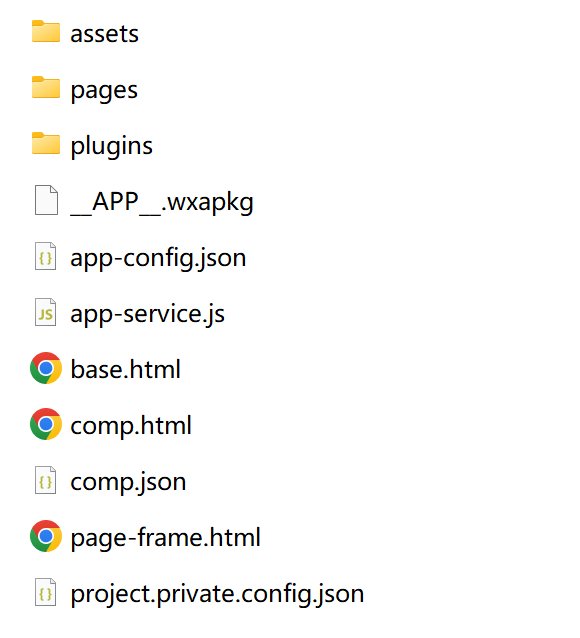
  </div>
  <div>
    <h4>还原后</h4>
    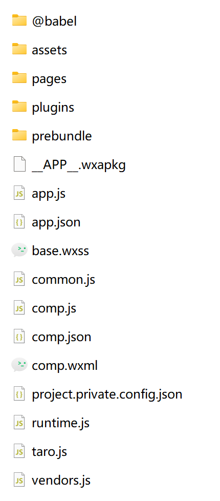 
  </div>
</div>

#### 微信开发者工具运行

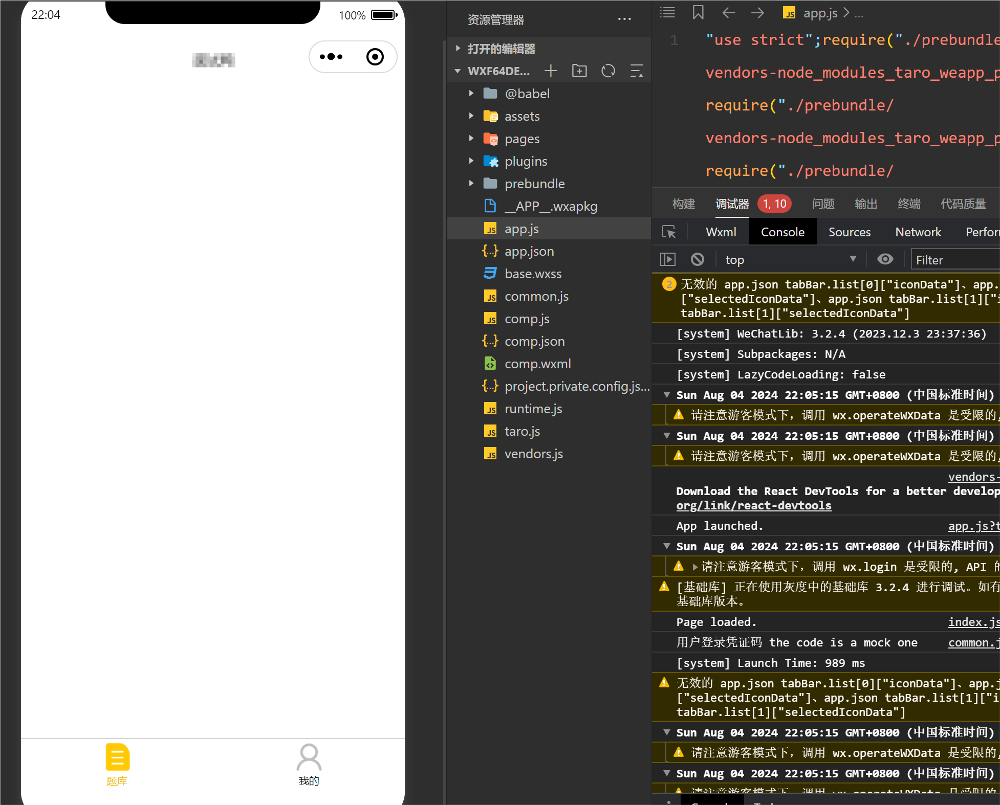

### Hook支持版本列表

| 小程序版本     |
|-----------|
| 9193_x64  |
| 11159_x64 |
| 9185_x64  |
| 9129_x64  |
| 9115_x64  |
| 8555_x64  |
| 9105_x64  |
| 8555_x64  |
| 9079_x64  |
| 8531_x64  |
| 8529_x64  |
| 8519_x64  |
| 8501_x64  |
| 8461_x64  |
| 8447_x64  |

#### 如何查看当前运行版本？

<div style="display: flex ">
  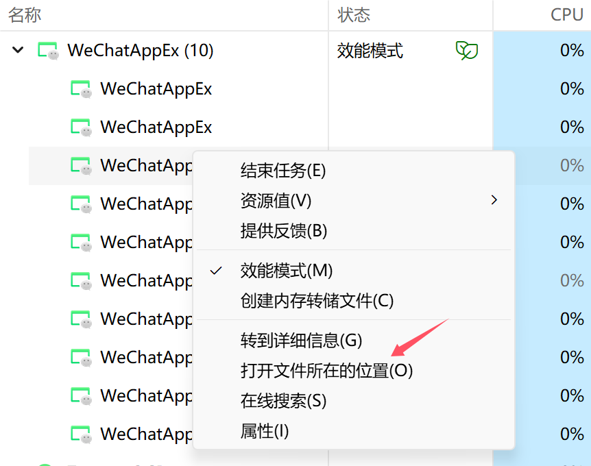
  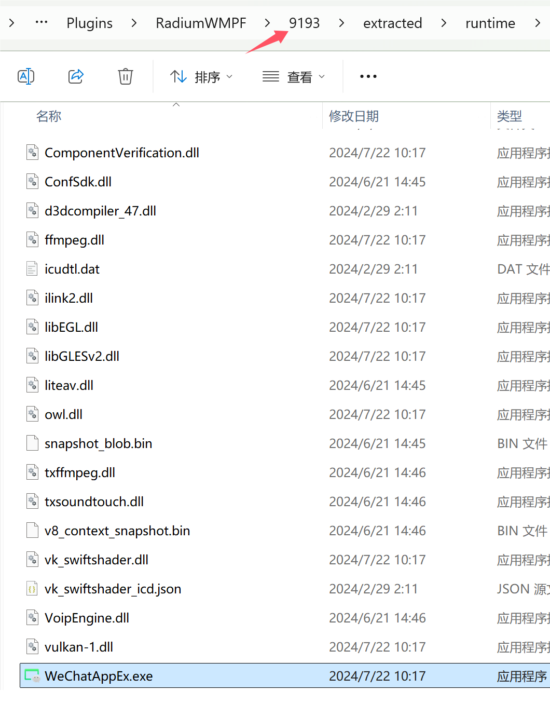
</div>

#### 开启小程序F12

> **运行前先启动微信（建议小号，有被封号风险）**

```shell
<本程序> -hook
 ```

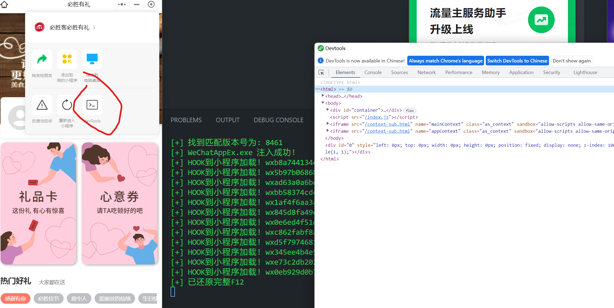

### 重新打包运行

```shell
<本程序> -repack=<输入目录> [-out=<输出目录或文件>] [-watch]
 ```

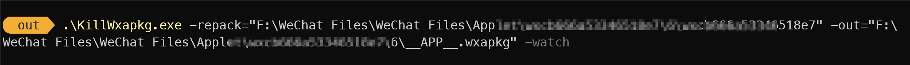

#### 效果示例

<div style="display: flex ">
  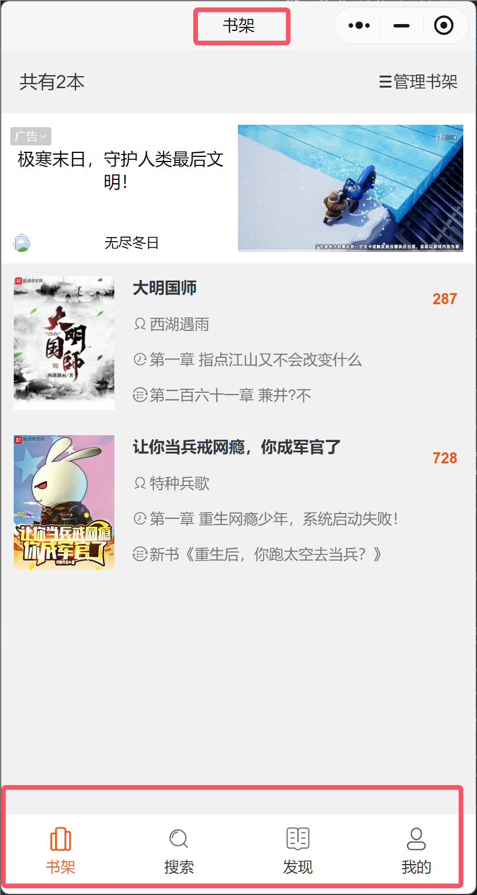
  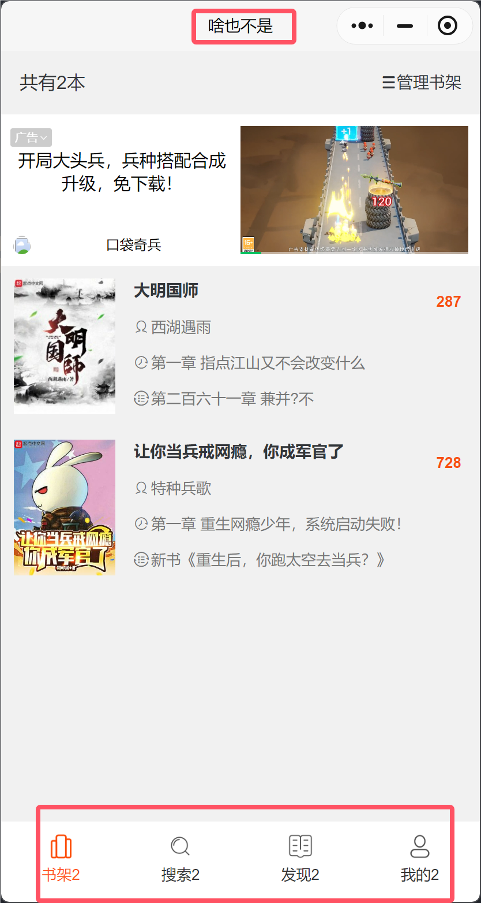
</div>

## 安装

- 下载最新版本的[release](https://github.com/Ackites/KillWxapkg/releases)包
- 自行编译
  ```shell
  # 克隆项目
  git clone https://github.com/Ackites/KillWxapkg.git
  
  # 进入项目目录
  cd ./KillWxapkg
  
  # 下载依赖
  go mod tidy
  
  # 编译
  go build
  ```

## 用法

> -id=<输入AppID> -in=<输入文件1,输入文件2> 或 -in=<输入目录> -out=<输出目录> 
> [-ext=<文件后缀>] [-restore] [-pretty] [-noClean] [-help] [-hook] [-save] [-repack=<输入目录>] [-watch] [-sensitive]

### 参数说明
- `-id string`
    - 微信小程序的AppID
    - 包已解密，可不指定
    - 例：-id=wx7627e1630485288d
- `-in string`
    - 输入文件路径（多个文件用逗号分隔）或输入目录路径
    - 自动检测，已解密的包，自动解包，未解密的包，自动解密后解包
    - 解密后的包会保存到输入目录下以AppID命名的文件夹
    - 例：-in="app.wxpkg,app1.wxapkg"
    - 例：-in="C:\Users\mi\Desktop\Applet\64"
- `-out string`
    -  输出目录路径（如果未指定，则默认保存到输入目录下以AppID命名的文件夹）
- `-restore`
    -  是否还原源代码工程目录结构，默认不还原
- `-pretty`
    - 是否美化输出，默认不美化，美化需较长时间
- `-ext string`
    - 处理的文件后缀 (default ".wxapkg")
    - 例：-ext=.wxapkg
- `-noClean`
    - 是否清理反编译的中间文件，默认清理
- `-hook`
    - 是否Hook小程序，动态调试，开启F12，默认不Hook
    - **注意：目前仅支持Windows，建议小号，有封号风险**
- `-save`
    - 是否保存解密后的文件，默认不保存
- `-repack string`
    - 重新打包目录路径
    - 例：-repack="C:\Users\mi\Desktop\Applet\64"
    - **注意：目前仅支持一次打包一个文件，同时仅支持未被解析的源文件（未使用-restore）**
- `-watch`
    - 是否监听将要打包的文件夹，并自动打包，默认不监听
- `-sensitive`
    - 是否导出敏感数据，默认不导出，导出后会在工具目录下生成sensitive_data.json文件，支持自定义规则
- `-help`
    - 显示帮助信息

### 获取微信小程序AppID

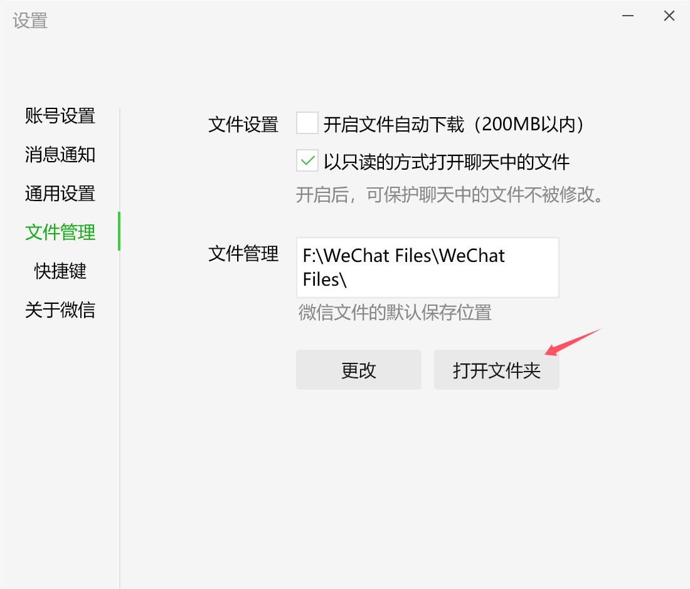

#### 文件夹名即为AppID

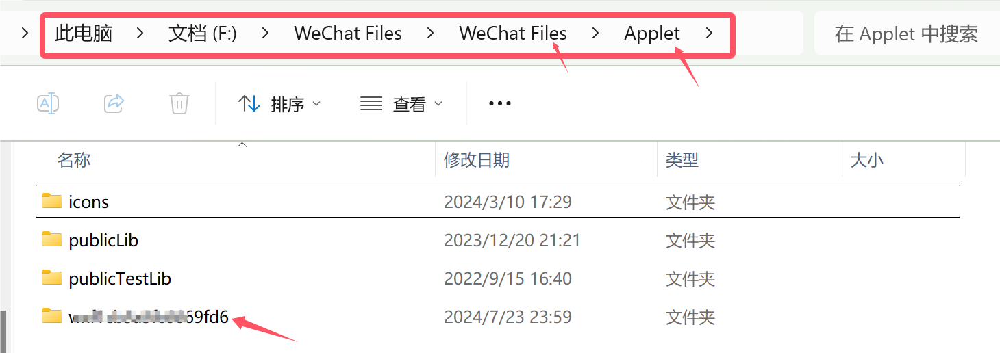

进入文件夹下，即可找到.wxapkg文件


## Star History

[](https://star-history.com/#Ackites/KillWxapkg&Date)