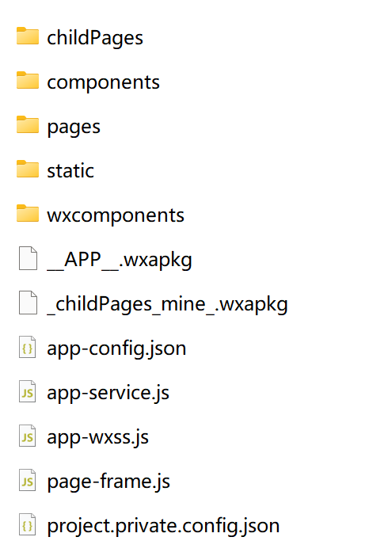
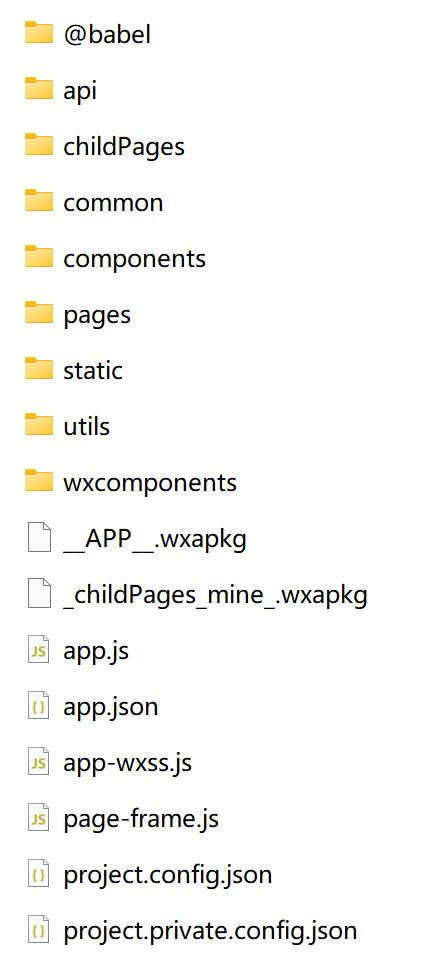

# KillWxapkg

> 存Golang实现，一个用于自动化反编译微信小程序的工具，小程序安全利器，自动解密，解包，可最大程度还原工程目录

[](https://github.com/Ackites/KillWxapkg)
[]()
[]()
[]()
[]()
[]()
[]()
[]()
[]()
[]()
[]()
[]()
------------------
## 介绍

**因为采用了UPX压缩了软件体积，工具运行时可能会出现误报，可以放心使用，工具不会对您的电脑造成任何损害。**

- [x] 小程序自动解密
- [x] 小程序自动解包，支持代码美化输出
  - [x] Json美化
  - [x] JavaScript美化
  - [x] Html美化
- [x] 支持还原源代码工程目录结构
  - [x] Json配置文件还原
  - [x] JavaScript代码还原
  - [ ] Wxml代码还原
  - [ ] Wxss代码还原
- [ ] 转换 Uni-app 项目
- [ ] 敏感数据导出

### 工程结构还原

#### 未还原


#### 还原后


## 安装

- 下载最新版本的[release](https://github.com/Ackites/KillWxapkg/releases)包
- 自行编译
  ```shell
  # 克隆项目
  git clone https://github.com/Ackites/KillWxapkg.git
  
  # 进入项目目录
  cd ./KillWxapkg
  
  # 下载依赖
  go mod tidy
  
  # 编译
  go build
  ```

## 用法

> 使用方法: program -id=<AppID> -in=<输入文件1,输入文件2> 或 -in=<输入目录> -out=<输出目录> 
> [-restore] [-pretty] [-ext=<文件后缀>] 

### 参数说明
- `-id string`
    - 微信小程序的AppID
    - 包已解密，可不指定
    - 例：-id=wx7627e1630485288d
- `-in string`
    - 输入文件路径（多个文件用逗号分隔）或输入目录路径
    - 自动检测，已解密的包，自动解包，未解密的包，自动解密后解包
    - 解密后的包会保存到输入目录下以AppID命名的文件夹
    - 例：-in="app.wxpkg,app1.wxapkg"
    - 例：-in="C:\Users\mi\Desktop\Applet\64"
- `-out string`
    -  输出目录路径（如果未指定，则默认保存到输入目录下以AppID命名的文件夹）
- `-restore`
    -  是否还原源代码工程目录结构，默认不还原
- `-pretty`
    - 是否美化输出，默认不美化，美化需较长时间
- `-ext string`
  - 处理的文件后缀 (default ".wxapkg")
  - 例：-ext=.wxapkg
- `-help`
    - 显示帮助信息

### 获取微信小程序AppID


#### 文件夹名即为AppID


进入文件夹下，即可找到.wxapkg文件


## Star History

[](https://star-history.com/#Ackites/KillWxapkg&Date)